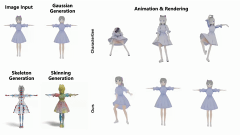

<div align="center">

# [DRiVE: Diffusion-based Rigging Empowers Generation of Versatile and Expressive Characters](https://driveavatar.github.io/)

_**Mingze Sun, Junhao Chen, Junting Dong, Yurun Chen, Xinyu Jiang, Shiwei Mao, Puhua Jiang, Jingbo Wang, Bo Dai, Ruqi Huang**_

<a href='https://arxiv.org/abs/2411.17423'></a>
<a href='https://driveavatar.github.io/'></a>



</div>

## Coming Soon...


## Citation

```bibtex
@article{sun2024drivediffusionbasedriggingempowers,
      title={DRiVE: Diffusion-based Rigging Empowers Generation of Versatile and Expressive Characters}, 
      author={Mingze Sun and Junhao Chen and Junting Dong and Yurun Chen and Xinyu Jiang and Shiwei Mao and Puhua Jiang and Jingbo Wang and Bo Dai and Ruqi Huang},
      year={2024},
      eprint={2411.17423},
      archivePrefix={arXiv},
      primaryClass={cs.CV},
      url={https://arxiv.org/abs/2411.17423}, 
}
```